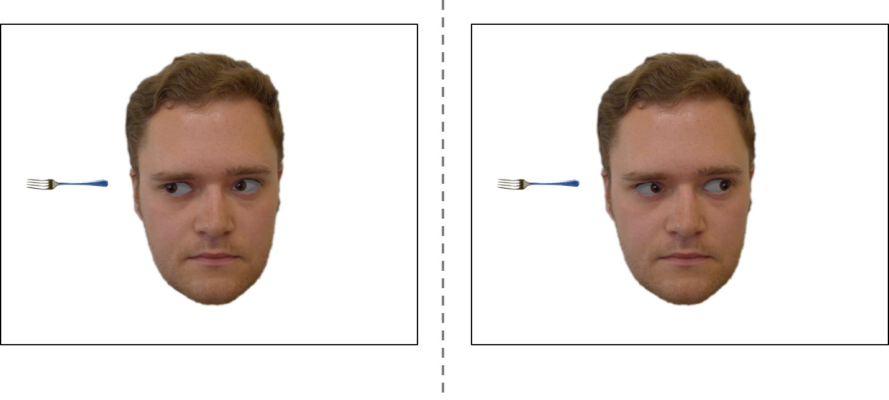

When we see a person’s eyes move, our own attention reorients towards what they are looking at. This results in faster and easier processing of targets in the gazed-at location than of targets in an ignored location.

My PhD looked at exploiting this gaze-cueing effect to manipulate social judgements of the faces involved. We presented participants with faces that consistently provided valid or invalid cues to a target object's location, and found that after this cueing participants rated valid faces as more trustworthy and invalid faces as less trustworthy.

We found that these judgements are specific to trust, are surprisingly long-lasting, and seem to be primarily driven by people finding invalid faces untrustworthy - suggesting a potential cheater detection mechanism aimed at guiding future interactions with the person.

I have recently started a collaboration with [Dr. Felicity Wolohan](https://www.edgehill.ac.uk/psychology/people/academic-staff/dr-felicity-wolohan/) at Edge Hill University to look at how this gaze-learning phenomenon can offer insights into how people bounce back following episodes of social exclusion. With the support of a BA/Leverhulme Small Research Grant in early 2020, we are working on a project that aims to directly test how sensitive socially excluded individuals are to social cues in their environment, how they use these cues to derive information about how to reintegrate, and how these processes differ in people who are chronically lonely. 

If you are interested in more information about this project, check out some of my published papers from during and after my PhD, listed below. For less academic resources, see below:

- *How do we decide who to trust? Our eyes could hold important clues*. [University of York Research Highlights](https://www.york.ac.uk/research/themes/trust/)
- *Why do I trust you?* UK national semi-finalist entry in the [2015 3 Minute Thesis competition](https://www.vitae.ac.uk/events/three-minute-thesis-competition/3mt-2015/copy_of_uk-3mt-semi-finalists-2015)
